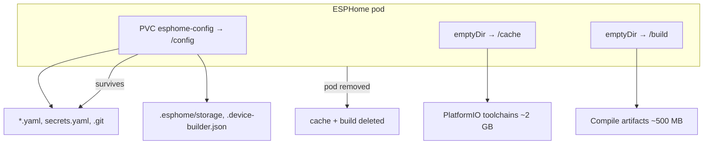

# ESPHome storage layout

ESPHome runs on micro.lan as a rootless Podman quadlet. The pod spec is in [`files/pod/pod-esphome.yml`](files/pod/pod-esphome.yml), the systemd unit in [`files/kube/esphome.kube`](files/kube/esphome.kube), and deployment via [`run-podman-quadlet-esphome.yml`](run-podman-quadlet-esphome.yml).

## Why three volumes?

ESPHome compiles firmware for ESP32 devices on the server using PlatformIO. That pulls in large cross-compilation toolchains (~2 GB) and per-device build trees (~500 MB). With only a single `/config` mount, all of that accumulated in the `esphome-config` Podman volume — reaching ~5 GB while the actual YAML configs stayed under 20 KB.

The official ESPHome Docker entrypoint detects optional `/cache` and `/build` mount points and keeps compile infrastructure out of `/config`. We use `emptyDir` volumes for those paths so Podman deletes them when the pod is removed.

## Storage layout



| Mount | Volume type | Podman volume | Holds |
|-------|-------------|---------------|-------|
| `/config` | `persistentVolumeClaim` | `esphome-config` | Device YAML configs, `secrets.yaml`, `.esphome/storage`, `.device-builder.json`, optional `.git` |
| `/cache` | `emptyDir` | `esphome-cache` (ephemeral) | PlatformIO packages, platforms, and cache (`/cache/platformio`) |
| `/build` | `emptyDir` | `esphome-build` (ephemeral) | Per-device compile output (`ESPHOME_BUILD_PATH=/build`) |

`podman kube play` creates named volumes for all three mounts — emptyDir volumes are not nameless in `podman volume ls`. They are still ephemeral: Podman removes them when the pod is removed. You can tell PVC from emptyDir with `podman volume inspect`:

```bash
podman volume inspect esphome-config esphome-cache esphome-build \
  --format '{{.Name}}: anonymous={{.Anonymous}}'
```

`esphome-config` has `anonymous=false`; `esphome-cache` and `esphome-build` have `anonymous=true`. The two emptyDir volumes are otherwise identical in inspect output — distinguish them by name or via container mounts (`podman inspect esphome-esphome --format '{{range .Mounts}}{{.Name}} -> {{.Destination}}{{println}}{{end}}'`).

On micro.lan the persistent volume data lives at:

```
/var/mnt/containers/bblasco/storage/volumes/esphome-config/_data
```

No environment variables are required — the ESPHome entrypoint auto-detects `/cache` and `/build`.

## What persists across restarts

**Devices are always remembered.** The dashboard discovers devices by scanning YAML files under `/config`. That path is on the PVC.

| Restart type | Devices in dashboard | Toolchain cache (`/cache`) | Build cache (`/build`) |
|--------------|---------------------|----------------------------|------------------------|
| Container restart (same pod) | Yes | Yes | Yes |
| Pod recreate (image update, `podman kube play` replace) | Yes | No — re-download on next compile | No — recompile from YAML |

Flashed firmware on the physical ESP32 devices is unaffected by any of this.

## Tradeoffs

When the pod is recreated, the next compile re-downloads ~2 GB of toolchains and rebuilds from scratch. That is slower and uses bandwidth, but the `esphome-config` PVC stays tiny — which keeps block-level backups practical.

`emptyDir` volumes are disk-backed (not RAM tmpfs) because the toolchains are too large for memory-backed tmpfs.

## Manual cleanup commands (FYI)

ESPHome does not auto-clean after compiles. These commands are useful for troubleshooting or one-off space reclamation, but they do **not** replace the emptyDir layout — with a single `/config` mount, the next compile would refill the PVC anyway.

Run inside the container:

```bash
podman exec -it esphome-esphome esphome clean <config.yaml>
podman exec -it esphome-esphome esphome clean-all /config
```

The dashboard **Clean** button on a device card is equivalent to `esphome clean` for that device.

| Command | Scope | Build artifacts | Toolchain packages (~2 GB) |
|---------|-------|-----------------|----------------------------|
| `esphome clean device.yaml` | One device | Yes | No — only PlatformIO cache dir (cmake/temp) |
| `esphome clean-all /config` | All devices | Yes | Yes — packages, platforms, cache, core |
| Dashboard **Clean** | One device | Same as `esphome clean` | No |

`clean-all` preserves `.esphome/storage/` and `.json` files so the dashboard keeps working.

Neither command removes a legacy `.platformio/` directory at the volume root (outside `.esphome/`). If that appears, delete it manually:

```bash
rm -rf /var/mnt/containers/bblasco/storage/volumes/esphome-config/_data/.platformio
```

With the `/cache` and `/build` mounts in place, `.esphome/platformio`, `.esphome/build`, and `.cache` should not regrow under `/config`. If they do after a misconfiguration, stop the service and remove them:

```bash
systemctl --user stop esphome.service
rm -rf .../esphome-config/_data/.platformio \
       .../esphome-config/_data/.esphome/platformio \
       .../esphome-config/_data/.esphome/build \
       .../esphome-config/_data/.cache
systemctl --user start esphome.service
```

## References

- [ESPHome Docker entrypoint](https://github.com/esphome/esphome/blob/dev/docker/docker_entrypoint.sh) — `/cache` and `/build` detection
- [ESPHome CLI — clean and clean-all](https://esphome.io/guides/cli/)
