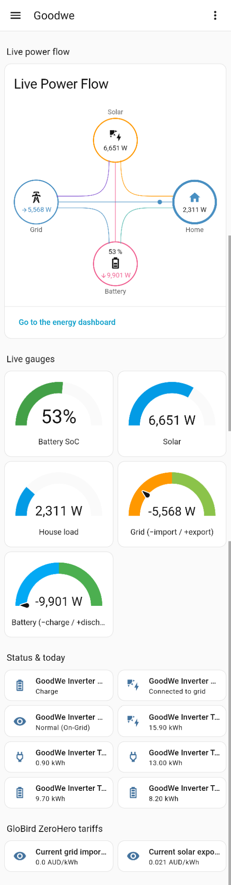

# Goodwe solar dashboard

Live solar/battery data from the **GoodWe inverter** (Modbus TCP), shown in the HA dashboard at `/dashboard-goodwe`.



## Overview

The dashboard compares two live views of the same data:

1. **Power Flow Card** — animated flow diagram (similar to the Goodwe app)
2. **Gauge cards** — numeric dials for the same metrics

The **Energy Dashboard** (`/energy`) uses GoodWe cumulative meters plus GloBird ZeroHero tariff helpers for cost/earnings.

### Energy Dashboard entities

| Purpose | Entity |
|---------|--------|
| Grid import (lifetime) | `sensor.meter_total_energy_import` |
| Grid export (lifetime) | `sensor.meter_total_energy_export` |
| Solar production | `sensor.total_pv_generation` |
| Battery charge in | `sensor.total_battery_charge` |
| Battery discharge out | `sensor.total_battery_discharge` |
| Import price (TOU) | `sensor.globird_grid_import_price` |
| Export price (TOU) | `sensor.globird_solar_export_price` |

## Live power flow

**Power Flow Card Plus** uses **split power entities** with positive magnitudes for each direction.

GoodWe sign convention (via Modbus): negative `meter_active_power_l1` = grid **import**, negative `battery_power` = battery **charge**. Template sensors split these into always-positive values for the card.

| Circle | Consumption entity | Production entity |
|--------|-------------------|-------------------|
| Grid | `sensor.goodwe_grid_import_power` | `sensor.goodwe_grid_export_power` |
| Battery | `sensor.goodwe_battery_discharge_power` | `sensor.goodwe_battery_charge_power` |
| Solar | — | `sensor.pv_power` |
| Home | `sensor.house_consumption` (override_state) | — |

## Live gauges

Gauge cards show the same live data as the power-flow numbers. Grid and battery gauges use signed GoodWe sensors with the needle at zero (−import/−charge, +export/+discharge). Blue/orange = charge/import (left), green = discharge/export (right).

## Status and today

**Inverter status** and **today's energy totals** (kWh, reset at midnight) are shown as tile cards:

- `sensor.battery_mode`, `sensor.grid_mode`, `sensor.work_mode`
- `sensor.today_s_pv_generation`, `sensor.today_energy_import`, `sensor.today_energy_export`
- `sensor.today_battery_charge`, `sensor.today_battery_discharge`

## GloBird ZeroHero tariffs

**GloBird ZeroHero** (United Energy, VIC) — rates used by the HA Energy Dashboard.

Template helpers switch price by time of day (Melbourne local):

### Grid import

| Period | Import $/kWh | When |
|--------|-------------|------|
| ZeroCharge | $0.00 | 11:00–14:00 |
| Peak | $0.352 | 16:00–23:00 |
| Shoulder | $0.22 | all other hours |

### Solar export (FIT)

| Period | Export $/kWh | When |
|--------|-------------|------|
| Midday FIT | $0.021 | 10:00–14:00 |
| Evening FIT | $0.09 | 16:00–18:00 |
| Super Export | $0.15 | 18:00–21:00 (approx.; real bill tops up to 15c for first 15 kWh/day) |
| Other | $0.041 | 21:00–10:00 |

**Not modelled in HA:** daily supply charge ($1.023/day), $1/day ZeroHero credit (grid import < 0.03 kWh/h during 18:00–21:00), ZeroLimits critical-peak credits.

Sources: [ZeroHero](https://www.globirdenergy.com.au/energy-saver/zerohero/), [VPP FAQ](https://www.globirdenergy.com.au/help-support/faq-vpp/). Verify rates against your United Energy fact sheet.

Current tariff tiles: `sensor.globird_grid_import_price`, `sensor.globird_solar_export_price`.

# Home Assistant MCP server

The home assistant pod contains this unofficial MCP server:
https://github.com/homeassistant-ai/ha-mcp

Setup guide:
https://homeassistant-ai.github.io/ha-mcp/setup/

Troubleshooting guide:
https://homeassistant-ai.github.io/ha-mcp/faq/


## Home Assistant MCP server client configuration

For cursor, you need the following client configuration:
```
{
  "mcpServers": {
    "home-assistant": {
      "url": "http://<MCP SERVER URL>:<MCP SERVER PORT>/mcp",
      "transport": "http"
    }
  }
}
```

In my case the URL line reads as `"url": "http://micro.lan:8086/mcp"`

# Ben's Home Assistant container Bluetooth config

Rough notes on getting Bluetooth working here for posterity

1. NOT REQUIRED edit the bluetooth.conf to allow me as a user all the relevant privileges?

2. sudo chown -R bblasco:bblasco /home/bblasco/.local/share/containers/storage/volumes/h3-config/
This is due to the following bug:
"podman run is not honoring --userns=keep-id --user=1000:1000 settings while creating volumes"
https://github.com/containers/podman/issues/16741

4. Make the relevant SELinux changes on the system
	1. You see something like this in /var/log/audit/audit.log: `type=USER_AVC msg=audit(1683117204.775:2041): pid=817 uid=81 auid=4294967295 ses=4294967295 subj=system_u:system_r:system_dbusd_t:s0-s0:c0.c1023 msg='avc:  denied  { send_msg } for  scontext=system_u:system_r:bluetooth_t:s0 tcontext=unconfined_u:system_r:spc_t:s0 tclass=dbus permissive=0 exe="/usr/bin/dbus-broker" sauid=81 hostname=? addr=? terminal=?'UID="dbus" AUID="unset" SAUID="dbus"`
	2. Check what the issue is: 
```[root@opti ~]# grep tooth /var/log/audit/audit.log | tail -1 | audit2why
type=USER_AVC msg=audit(1683117372.225:2274): pid=817 uid=81 auid=4294967295 ses=4294967295 subj=system_u:system_r:system_dbusd_t:s0-s0:c0.c1023 msg='avc:  denied  { send_msg } for  scontext=system_u:system_r:bluetooth_t:s0 tcontext=unconfined_u:system_r:spc_t:s0 tclass=dbus permissive=0 exe="/usr/bin/dbus-broker" sauid=81 hostname=? addr=? terminal=?'UID="dbus" AUID="unset" SAUID="dbus"

        Was caused by:
                Missing type enforcement (TE) allow rule.

                You can use audit2allow to generate a loadable module to allow this access.
```

    3. Generate the module:
```
[root@opti ~]# grep tooth /var/log/audit/audit.log | tail -1 | audit2allow -a -M bluetooth_homeassistant
******************** IMPORTANT ***********************
To make this policy package active, execute:

semodule -i bluetooth_homeassistant.pp
```
