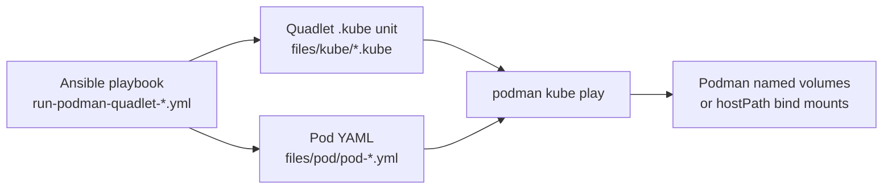

# Selective volume backup labeling

This document captures research and design options for labeling Podman volumes so backup tooling can select which volumes to include or exclude. **Selective labeling is not implemented in this repo** — the notes below are kept for future reference.

**Current approach:** indiscriminate backup of all Podman named volumes is already implemented in the [backups-personal](https://github.com/benblasco/backups-personal) repository (option 1 below). That backs up every named volume for configured users; it does not use volume labels and does not need changes to the Pod YAML in this repo.

Workloads in this repo use Kubernetes Pod YAML deployed via Podman Quadlet and Ansible (`fedora.linux_system_roles.podman`). See also [`README.esphome.md`](README.esphome.md) for an example of encoding backup intent structurally via volume types (`emptyDir` vs PVC).

## Short answer

**Not in the form we use today.** Inline `spec.volumes` entries in Pod YAML files (e.g. [`files/pod/pod-arrsuite.yml`](files/pod/pod-arrsuite.yml)) do not support `labels` or `annotations` on individual volumes. The repo has no standalone `PersistentVolumeClaim` resources and no Quadlet `.volume` units — the two places where Podman does allow volume metadata.

Pod-level labels (like `io.containers.autoupdate`) apply to the whole pod, not to individual volumes.

## How volumes are defined today



Each PVC reference is just a name:

```yaml
  volumes:
    - name: sonarr-config
      persistentVolumeClaim:
        claimName: sonarr-config
    - name: media
      hostPath:
        path: /mnt/sg1/media
```

When `podman kube play` runs this, Podman creates named volumes `sonarr-config`, etc. under the rootless user's storage path (e.g. `/var/mnt/containers/<user>/storage/volumes/<name>/_data`). A `hostPath` entry is a **host bind mount** — not a Podman volume at all.

## Example: arrsuite

[`files/pod/pod-arrsuite.yml`](files/pod/pod-arrsuite.yml) illustrates why selective backup matters:

| Volume | Type | Backup intent (implicit today) |
|--------|------|--------------------------------|
| `sonarr-config` | PVC | Yes — app config, small |
| `prowlarr-config` | PVC | Yes — app config, small |
| `radarr-config` | PVC | Yes — app config, small |
| `lidarr-config` | PVC | Yes — app config, small |
| `media` | hostPath `/mnt/sg1/media` | Different strategy — large shared media library, not a Podman volume |

ESPHome ([`files/pod/pod-esphome.yml`](files/pod/pod-esphome.yml)) encodes backup intent structurally: only `esphome-config` is a PVC; `/cache` and `/build` are `emptyDir` (ephemeral, excluded from backup).

## What Podman supports for volume metadata

### 1. Inline Pod `spec.volumes` (current pattern)

**No labels or annotations.** Pod volume entries only accept type-specific fields (`claimName`, `path`, etc.).

### 2. Standalone `PersistentVolumeClaim` YAML (recommended YAML-native approach)

`podman kube play` can process separate PVC documents in the same YAML file (one document per volume).

**`metadata.labels`** on a standalone PVC are passed to Podman volume creation ([`play.go`](https://github.com/containers/podman/blob/main/pkg/domain/infra/abi/play.go)):

```go
libpod.WithVolumeLabels(pvcYAML.Labels),
```

This is **implemented but undocumented** in the man page. The man page only documents `volume.podman.io/*` **annotations** for volume creation options (uid, gid, driver, mount-options):

```yaml
---
apiVersion: v1
kind: PersistentVolumeClaim
metadata:
  name: esphome-config
  labels:
    backup: include
    workload: esphome
  annotations:
    volume.podman.io/uid: "1000"
    volume.podman.io/gid: "1000"
spec:
  accessModes:
    - ReadWriteOnce
  resources:
    requests:
      storage: 1Gi
---
apiVersion: v1
kind: Pod
metadata:
  name: esphome
  # ... rest of pod-esphome.yml unchanged
```

The PVC document must appear **before** the Pod (kube play sorts kinds). The Pod keeps `claimName: esphome-config` in `spec.volumes`.

#### Multiple labeled volumes in one pod

**One YAML document per volume** — not one document for all volumes. Each `PersistentVolumeClaim` has one `metadata.name`. For arrsuite, that means four PVC documents plus one Pod document in the same file, separated by `---`:

```yaml
---
apiVersion: v1
kind: PersistentVolumeClaim
metadata:
  name: sonarr-config
  labels:
    backup: include
spec:
  accessModes: [ReadWriteOnce]
  resources:
    requests:
      storage: 1Gi
---
apiVersion: v1
kind: PersistentVolumeClaim
metadata:
  name: prowlarr-config
  labels:
    backup: include
spec:
  accessModes: [ReadWriteOnce]
  resources:
    requests:
      storage: 1Gi
# ... radarr-config, lidarr-config similarly
---
apiVersion: v1
kind: Pod
metadata:
  name: arrsuite
spec:
  volumes:
    - name: sonarr-config
      persistentVolumeClaim:
        claimName: sonarr-config
    # ... other PVC refs + media hostPath stay here
```

Volumes you do not label (`emptyDir`, `hostPath`) stay only in the Pod's `spec.volumes` — no PVC document for those.

### 3. Quadlet `.volume` units (alternative)

Quadlet volume files support OCI labels via `Label=`:

```ini
# files/volume/esphome-config.volume (proposed)
[Unit]
Description=ESPHome config Podman volume
Before=local-fs.target

[Volume]
VolumeName=esphome-config
User=1000
Group=1000
Label=backup=include
Label=workload=esphome

[Install]
WantedBy=default.target
```

This is a **split**, not a migration out of Kubernetes YAML:

| Concern | Stays in Pod YAML | Moves to `.volume` unit |
|---------|-------------------|-------------------------|
| Where a volume is mounted (`volumeMounts`) | Yes | No |
| Volume reference in `spec.volumes` | Yes | No |
| Podman volume creation (name, labels, uid/gid) | No | Yes |

Deploy order in `podman_quadlet_specs` must be: `.volume` files first, then `pod-*.yml`, then `.kube`. `VolumeName=` must match `claimName`.

Example playbook ordering for ESPHome:

```yaml
podman_quadlet_specs:
  # 1. Volume first — must exist (with labels) before kube play
  - file_src: volume/esphome-config.volume
    state: started
  # 2. Pod YAML
  - file_src: pod/pod-esphome.yml
  # 3. Kube unit — keep existing state: created workaround
  - file_src: kube/esphome.kube
    state: created
```

**Why `state: started` on the volume, not `created`?** In `fedora.linux_system_roles.podman`, `created` installs the systemd unit without starting it; `started` runs `podman volume create`. The volume must exist before kube play.

**Why `state: created` on the kube file?** Existing ESPHome workaround for [podman#16741](https://github.com/containers/podman/issues/16741): defer pod start to fix ownership under `UserNS=keep-id`.

Optional dependency in [`files/kube/esphome.kube`](files/kube/esphome.kube):

```ini
After=esphome-config-volume.service
Requires=esphome-config-volume.service
```

### 4. Labels at creation time only (no post-creation relabeling)

```bash
podman volume create --label backup=include sonarr-config
podman volume ls --filter label=backup=include
```

There is **no** `podman volume label` subcommand. Relabeling after creation is an open feature request: [podman#25825](https://github.com/podman-container-tools/podman/issues/25825).

When kube play auto-creates a volume from inline `claimName`, it does so **without labels**. Labeled volumes must be pre-created (standalone PVC, Quadlet `.volume`, or `podman volume create --label`) before the pod starts.

**Caveat:** Podman uses `WithVolumeIgnoreIfExist()` for PVC-backed volumes. If a volume already exists unlabeled, adding labels later (via any method) will not retroactively apply them. Export data, remove the volume, recreate with labels, then restore.

## Practical options (ranked)

1. **Volume type + naming convention (zero YAML changes)** — Backup all Podman PVC `claimName` volumes; skip `emptyDir` and `hostPath`. **Implemented** in [backups-personal](https://github.com/benblasco/backups-personal): all Podman named volumes are backed up indiscriminately per configured user, without volume labels or manifest files.

2. **YAML comments** — `# backup: include` above volume entries. Human-readable, not machine-enforced.

3. **Standalone PVC documents in the same file (recommended if adopting labels)** — `metadata.labels` on each PVC document; one document per volume. Keeps everything in Kubernetes YAML without Quadlet `.volume` files.

4. **Quadlet `.volume` units + Ansible** — Pre-create labeled volumes outside Kubernetes YAML. More moving parts; useful if you need Quadlet-specific volume options.

5. **External backup manifest** — Ansible vars or a YAML file listing volumes/paths to include or exclude. No Podman labels; backup tooling reads the manifest directly.

```yaml
# e.g. group_vars — not Podman metadata
backup_volumes:
  include:
    - sonarr-config
    - prowlarr-config
  exclude_host_paths:
    - /mnt/sg1/media
```

## Recommendation

**In use today** ([backups-personal](https://github.com/benblasco/backups-personal)): lowest-friction indiscriminate backup of all Podman named volumes per configured user. `emptyDir` and `hostPath` are naturally excluded because they are not Podman volumes. No volume labels or changes to Pod YAML in this repo are required.

If **selective** backup is needed later, options 2–5 above apply. The least clunky YAML-native path is **standalone PVC documents with `metadata.labels`** in the existing pod YAML files. Quadlet `.volume` units are the alternative if volume metadata should live outside Kubernetes YAML.

## Upstream feature requests

| Issue | What it asks for | Status |
|-------|------------------|--------|
| [podman#26450](https://github.com/containers/podman/issues/26450) | `podman kube play --labels` CLI flag for pods/secrets/volumes | Open; [PR #27677](https://github.com/containers/podman/pull/27677) adds `--labels` for pods only so far |
| [podman#25825](https://github.com/podman-container-tools/podman/issues/25825) | `podman volume label` to relabel after creation | Open |
| [Discussion #28697](https://github.com/containers/podman/discussions/28697) | `metadata.labels` on Secret objects not forwarded | Known gap for secrets |

No open issue specifically for labels on inline `spec.volumes[].persistentVolumeClaim` inside a Pod document — standalone PVC documents are the Kubernetes-native path Podman already supports.

## Why it feels clunky

- **Inline Pod `spec.volumes`** — no place for labels; auto-created volumes are unlabeled
- **Standalone PVC document** — labels work, but each volume needs its own YAML document in the same file
- **Quadlet `.volume` unit** — labels work, but live outside Kubernetes YAML
- **Documentation gap** — man page omits PVC `metadata.labels` support
